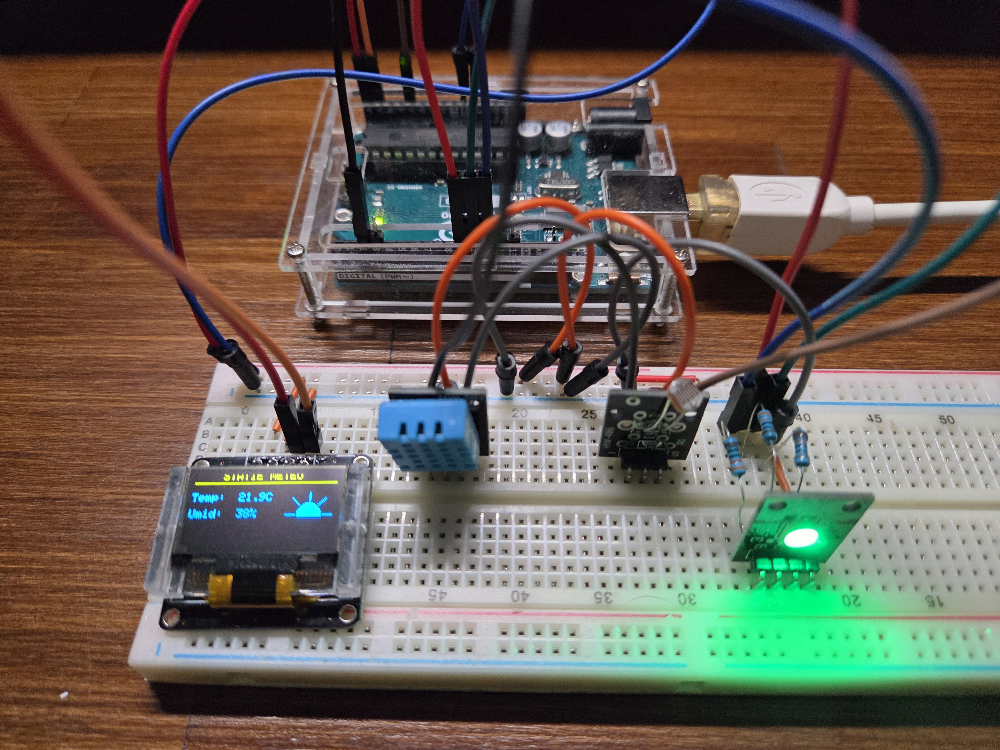
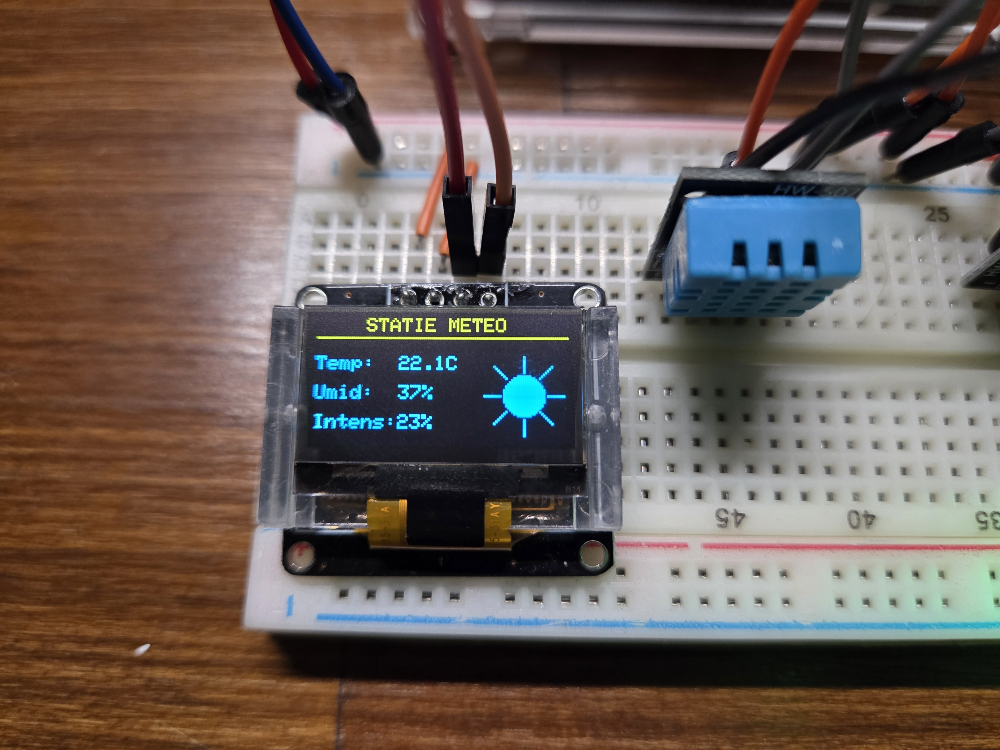

# Statie Meteo Interactiva cu Arduino Uno R3 🌤️

Acest proiect reprezinta o statie meteo inteligenta construita pe platforma Arduino Uno, dezvoltata folosind **PlatformIO**. Proiectul citeste date de mediu in timp real, afiseaza animatii dinamice pe un ecran OLED si ofera un dashboard live prin Serial Monitor.

## Functionalitati Principale
* **Afisaj OLED Dinamic:** Animatiile grafice se schimba in timp real in functie de temperatura (fulg de nea, soare, valuri de caldura).
* **Monitorizare Live:** Datele sunt procesate doar cand exista modificari si sunt transmise curat catre Serial Monitor prin rescrierea randului, fara a inunda consola.
* **Indicator Vizual RGB:** Un LED RGB isi schimba culoarea automat (Albastru = Frig, Verde = Confortabil, Rosu = Cald).
* **Optimizare Memorie:** Codul este optimizat pentru memoria RAM limitata a placii Arduino (2KB), folosind macroul `F()` si eliminand variabilele globale inutile.

---

## Interfata Utilizator (UI)

Urmatoarea imagine arata close-up-ul ecranului OLED. Se pot observa valorile citite (Temperatura, Umiditate, Intensitate luminoasa) si animatia activa:

---

## Componente Hardware si Cablaj

Statia este asamblata pe un breadboard. Poza de mai jos arata organizarea componentelor si traseul firelor (top-down view):

| Modul | Pini Modul | Conexiune Arduino Uno | Rol |
| :--- | :--- | :--- | :--- |
| **OLED SSD1306** | VCC, GND, SDA, SCL | 5V, GND, A4, A5 | Afisaj grafic |
| **HW-507 (DHT11)** | VCC, GND, Data | 5V, GND, D2 | Temperatura si Umiditate |
| **HW-486 (Intensitate LDR)** | VCC, GND, AO | 5V, GND, A1 | Intensitate luminoasa |
| **HW-478 (LED RGB)**| GND, R, G, B | GND, D9, D10, D11 (Pini PWM) | Indicator vizual |

---

## Cum rulezi proiectul
1. Cloneaza acest repository.
2. Deschide folderul in VS Code folosind extensia **PlatformIO**.
3. PlatformIO va descarca automat bibliotecile necesare (Adafruit GFX, Adafruit SSD1306, DHT sensor library).
4. Compileaza si incarca codul pe placa (`Upload`).
5. Deschide Serial Monitor la 9600 baud rate.